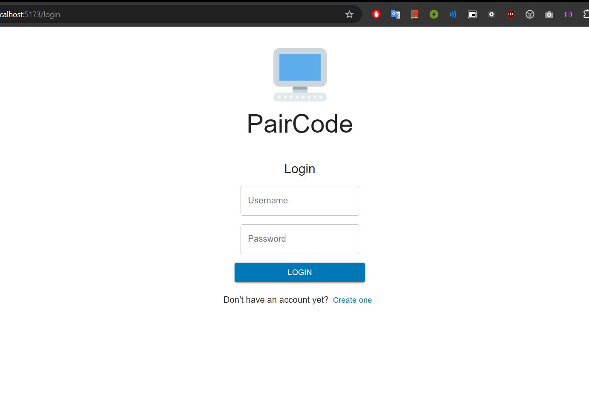
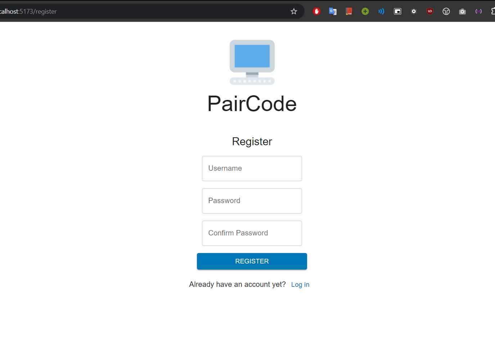
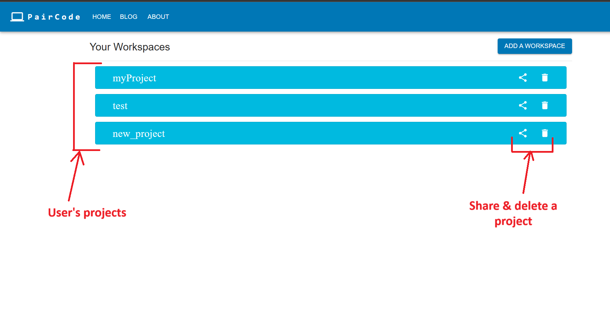
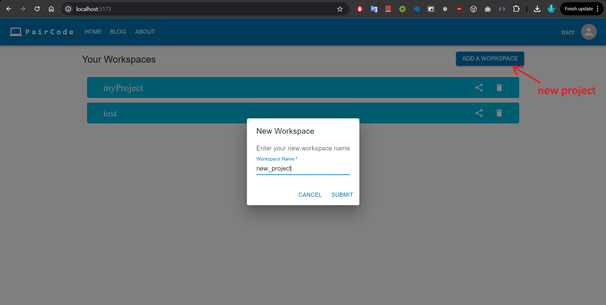
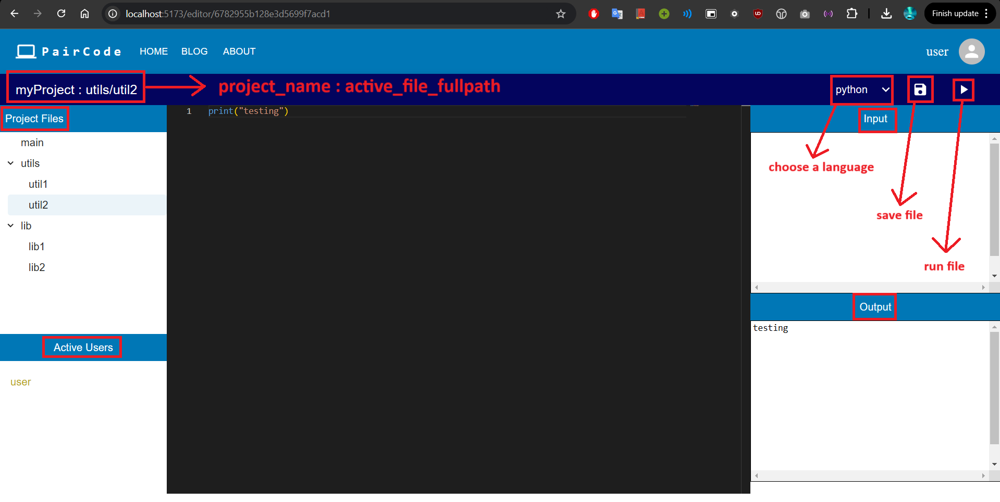
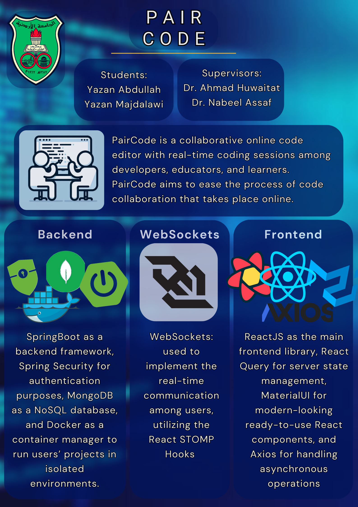

# PairCode
A collaborative, online, web-based code editor with real-time coding sessions among users that we built as a graduation project using several technologies, including:
* `SpringBoot` as a backend framework.
* `Spring Security` for authentication purposes.
* `MongoDB` as a NoSQL database.
* `Docker` as a container manager to run users’ projects in isolated environments.
* `WebSockets`: used to implement the real-time communication among users, utilizing the React STOMP Hooks.
* `ReactJS` as the main frontend library.
* `React Query` for server state management.
* `MaterialUI` for modern-looking ready-to-use React components.
* `Axios` for handling asynchronous operations.

---

**Here is a [YouTube video](https://youtu.be/OaRGzYyjNLE) that shows the basic features of the project**

---

